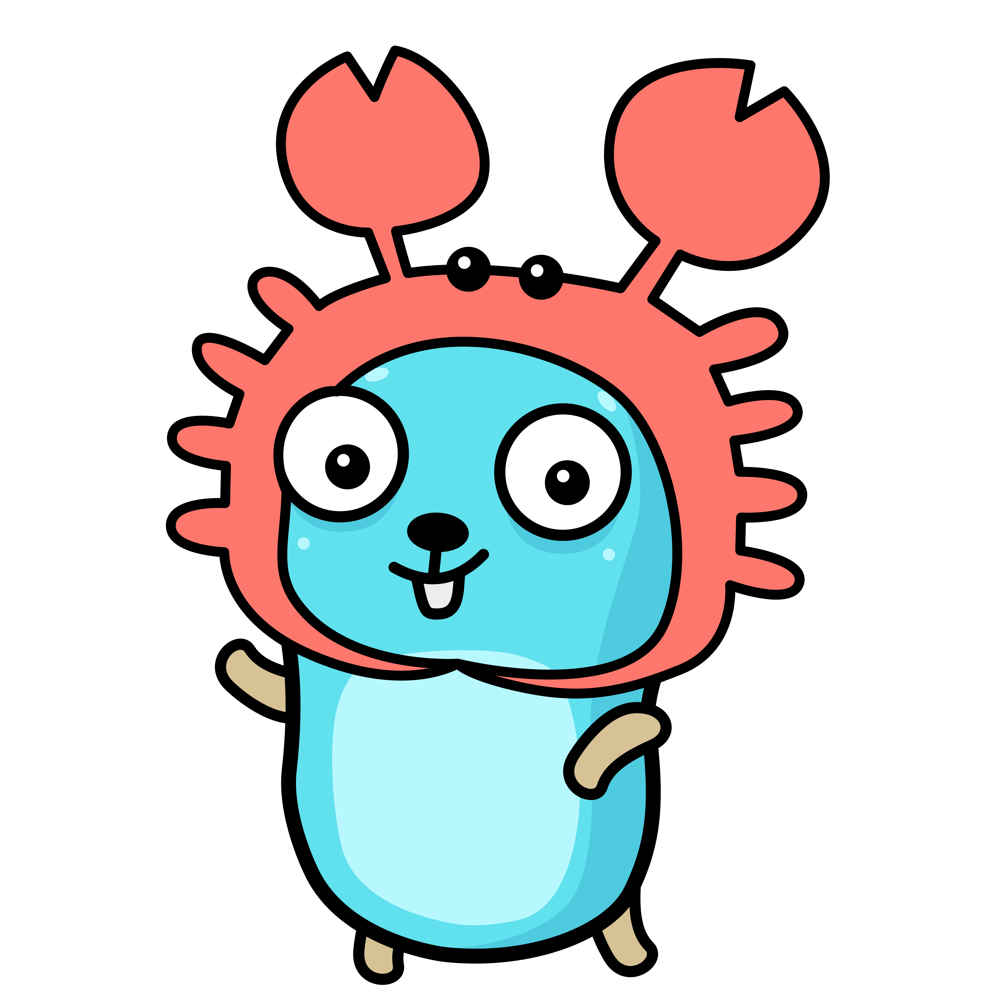

# Orakle 7th DEX Aggregating Team

**Research team exploring DEX aggregation technology**

---

## 🎯 About Us

We are a research team from Orakle 7th studying DEX aggregator technology.  
Our focus is on understanding how aggregators work, analyzing routing algorithms, and exploring smart contract architectures for optimal token swaps across multiple DEXs.

## 👥 Team Members

<table>
  <tr>
    <td align="center" style="background: transparent; width: 200px;">
      
       
      <b>박정호</b>
       
      <a href="https://github.com/kyle-park-io">@GitHub</a>
       
      <a href="https://www.linkedin.com/in/kyle-park-io/">@LinkedIn</a>
    </td>
        <td align="center" style="background: transparent; width: 200px;">
      
       
      <b>이은규</b>
       
      <a href="https://github.com/ddr4869">@GitHub</a>
    </td>
    <td align="center" style="background: transparent; width: 200px;">
      
       
      <b>황기운</b>
       
      <a href="https://github.com/GiHoon1123">@GitHub</a>
    </td>
  </tr>
</table>

